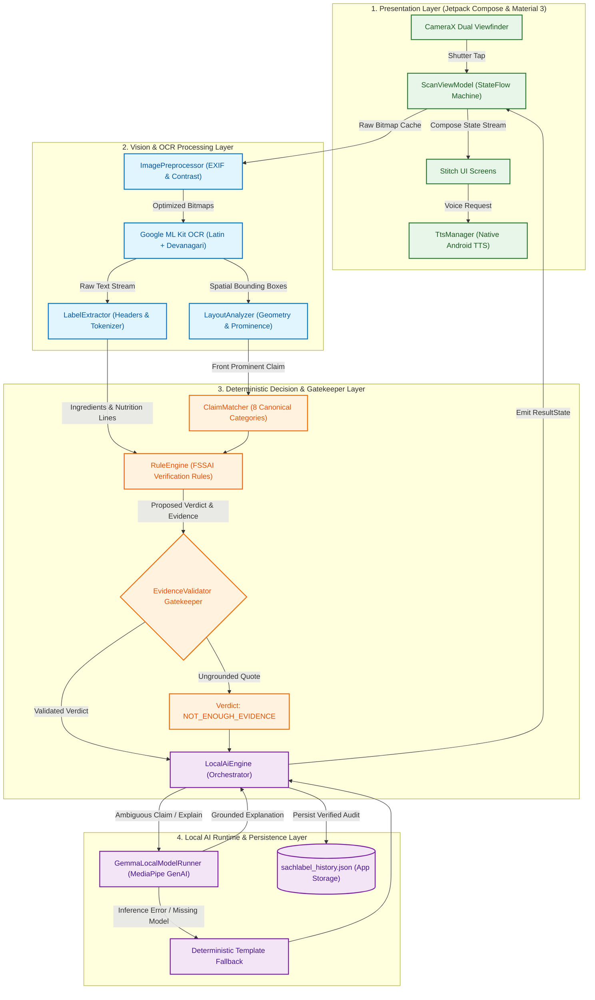
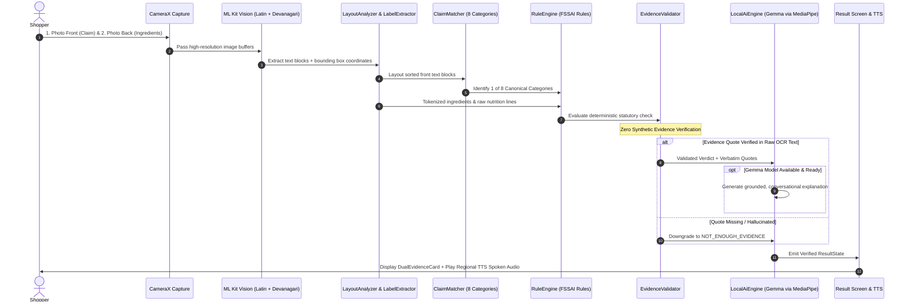
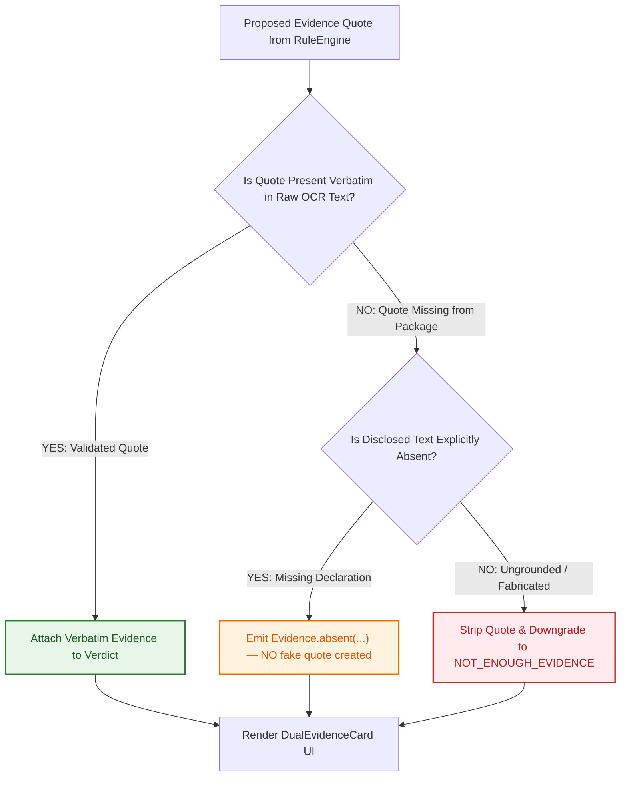

# SachLabel

> **AI that audits a product's own words against itself.**

SachLabel is an AI-assisted packaging intelligence app that audits a packaged product's front-of-pack claims directly against its own printed ingredients list, nutritional declaration, and fine print. The app presents an evidence-backed factual verdict alongside exact verbatim package citations in plain language, with regional-language spoken audio (Text-to-Speech) designed for in-aisle clarity.

```
REAL PACKAGE ──► FRONT/BACK PHOTOS ──► OCR + GEOMETRY ──► LABEL STRUCTURE / EXTRACTION
                                                                   │
                                                                   ▼
TTS AUDIO ◄── REGIONAL LANGUAGE ◄── OPTIONAL LOCAL GEMMA ◄── EVIDENCE VALIDATOR ◄── DETERMINISTIC RULES
```

---

[](https://developer.android.com)
[](https://kotlinlang.org)
[](https://developer.android.com/jetpack/compose)
[](https://developer.android.com/training/camerax)
[](https://developers.google.com/ml-kit/vision/text-recognition/v2)
[](https://developers.google.com/mediapipe)
[]()
[]()
[](LICENSE)

---

## What SachLabel Is vs. What It Is Not

| SachLabel IS | SachLabel is NOT |
| :--- | :--- |
| **Physical-package claim auditing** from front/back camera captures | A **0–100 health score** or nutrition rating |
| **Evidence-first label interpretation** grounded in OCR text | A **barcode-first database lookup** (e.g. Yuka) |
| **Deterministic verification** using codified FSSAI-aligned rules | A **medical diagnostic or treatment tool** |
| **Optional local AI explanation** via on-device Gemma | A **nutrition recommendation engine** |
| **Regional-language plain understanding** with native Android TTS | An **official regulatory authority or certification body** |
| **Transparent absence reporting** when text is missing | A **binary "safe/unsafe" classifier** |

---

## Visual Interface Overview

The interface follows a focused, evidence-first design language built with Jetpack Compose and Material 3:

| 1. Onboarding | 2. Home Dashboard | 3. Dual Camera Capture | 4. Evidence Verdict | 5. Past Audits History |
| :---: | :---: | :---: | :---: | :---: |
|  |  |  |  |  |
| *Clean welcome with mission & language selection* | *Action matrix, scan trigger & recent audit records* | *CameraX reticle, front/back step pill & live OCR* | *Verbatim dual evidence card & regional voice playback* | *Verified past product audits with search & filter* |

---

## 1. What Problem Does It Solve?

In grocery retail, packaged foods frequently feature prominent front-of-pack claims designed to capture purchasing decisions in seconds:

* *"No Added Sugar"*
* *"100% Natural / Pure"*
* *"Sugar-Free"*
* *"No Preservatives"*
* *"Organic"*
* *"High Protein"*
* *"Zero Trans Fat"*
* *"Immunity Booster / Wellness"*

Under food labeling regulations, manufacturers are required to disclose actual composition on the back of the pack — in the ingredients list and nutritional information table. However, consumers face major barriers:

1. **Information Asymmetry**: Fine print is deliberately small, printed on glossy or crinkled surfaces, and packed with complex chemical nomenclature (e.g., INS codes, maltodextrin, invert sugar, partially hydrogenated oils).
2. **Language & Literacy Barriers**: Packaged food claims and back disclosures in India are predominantly printed in English, while millions of primary grocery buyers read or communicate preferentially in Hindi, Marathi, Tamil, Bengali, or other regional languages.
3. **In-Aisle Decision Pressure**: Consumers make buying choices in 3–5 seconds per item. Nobody has the time to manually cross-reference statutory percentages while standing in a store aisle.
4. **Misleading Marketing**: A juice labeled *"No Added Sugar"* may be packed with reconstituted fruit juice concentrates yielding over 14g of free sugar per 100ml, or an *"Immunity Booster"* product may contain zero scientifically established active ingredients.

SachLabel bridges this gap by mechanically reading both sides of the package and highlighting whether the brand's own printed declarations corroborate or qualify its promotional assertion.

---

## 2. How is SachLabel Different from Barcode-First Scanners?

Existing commercial food scanner applications typically follow a **barcode-to-database lookup** model. SachLabel takes a fundamentally different approach:

| Dimension | Barcode-to-Database Scanners (e.g. Yuka) | SachLabel Dual-Pack Auditor |
| :--- | :--- | :--- |
| **Data Source** | Centralized product database indexed by EAN/UPC barcode. | The physical packaging in the user's hand, read via on-device computer vision. |
| **Catalog Dependency** | Fails on uncataloged items, regional Indian brands, or recent recipe updates. | **Direct packaging analysis**: Analyzes any physical package bearing readable English or Devanagari text; zero catalog dependency. |
| **Assessment Methodology** | Algorithmic 0–100 score based on generalized nutrition models. | **Deterministic evidence audit**: Evaluates whether the specific front claim is corroborated by printed back disclosures. |
| **Trust & Auditability** | Black-box opinion score. | **Zero synthetic evidence**: Cites verbatim printed lines or flags absent disclosures directly from the package. |
| **Accessibility** | Dense English charts, graphs, and numeric metrics. | Plain-language spoken audio (Text-to-Speech) in **8 Indian regional languages**. |
| **Network & Privacy** | Requires cloud API calls; transmits user scanning history. | **Local-first execution**: The core deterministic pipeline runs on-device without cloud API dependencies. |

---

## 3. System Design & Architecture

SachLabel's architecture is structured into four decoupled layers, prioritizing deterministic reliability, user privacy, and zero cloud latency:



---

## 4. End-to-End Multimodal Pipeline

The data transformation pipeline converts raw front and back camera captures into an audited, evidence-backed verdict with voice synthesis:



### Detailed Pipeline Stage Canvas

```
┌────────────────────────────────────────────────────────────────────────────────────────┐
│ STAGE 1: DUAL IMAGE CAPTURE (CameraX)                                                  │
│   • Step 1: Front frame capture -> cacheDir/sachlabel_front_TIMESTAMP.jpg              │
│   • Step 2: Back frame capture  -> cacheDir/sachlabel_back_TIMESTAMP.jpg               │
│   • Optical reticle guides alignment; flash toggle handles low-light supermarket aisles│
└──────────────────────────────────────────┬─────────────────────────────────────────────┘
                                           │
                                           ▼
┌────────────────────────────────────────────────────────────────────────────────────────┐
│ STAGE 2: OCR & GEOMETRIC RECOGNITION (Google ML Kit v2)                                │
│   • Dual Recognizer: TextRecognition.getClient(Latin + Devanagari)                     │
│   • Extracts text blocks with normalized bounding-box coordinates for spatial analysis │
│   • Preserves linebreaks and numeric indicators                                        │
└──────────────────────────────────────────┬─────────────────────────────────────────────┘
                                           │
                                           ▼
┌────────────────────────────────────────────────────────────────────────────────────────┐
│ STAGE 3: LAYOUT ANALYSIS & STRUCTURED LABEL EXTRACTION                                 │
│   • Scans for statutory headers: "Ingredients:", "सामग्री:", "Nutritional Information"  │
│   • Tokenizes comma-separated ingredients in mandatory order of predominance          │
│   • Captures exact unparsed nutrition lines into nutritionRawLines                     │
└──────────────────────────────────────────┬─────────────────────────────────────────────┘
                                           │
                                           ▼
┌────────────────────────────────────────────────────────────────────────────────────────┐
│ STAGE 4: CLAIM DETECTION & TAXONOMY ROUTING                                            │
│   • Fuzzy regex matcher scans front text against 8 canonical categories                │
│   • Identifies target category (e.g. CanonicalClaimCategory.NO_ADDED_SUGAR)            │
│   • Rejects arbitrary claims outside canonical scope with NO_CLAIM_DETECTED            │
└──────────────────────────────────────────┬─────────────────────────────────────────────┘
                                           │
                                           ▼
┌────────────────────────────────────────────────────────────────────────────────────────┐
│ STAGE 5: DETERMINISTIC RULE EVALUATION                                                 │
│   • Invokes category-specific rule function in RuleEngine.kt                           │
│   • Compares claim against back reality:                                               │
│       - Checks ingredients for hidden sugars, sweeteners, or synthetic preservatives   │
│       - Checks nutrition table against statutory thresholds (e.g. sugar <= 0.5g/100g)   │
│   • Emits: Verdict (VERIFIED, QUALIFIED, MISMATCH) + Verbatim Evidence Quote           │
└──────────────────────────────────────────┬─────────────────────────────────────────────┘
                                           │
                                           ▼
┌────────────────────────────────────────────────────────────────────────────────────────┐
│ STAGE 6: EVIDENCE GATEKEEPER & VALIDATION                                              │
│   • EvidenceValidator verifies that non-absent quotes exist verbatim in OCR raw text  │
│   • Rejects synthetic filler strings and hallucinated sentences                        │
│   • If quote is ungrounded: downgrades verdict to NOT_ENOUGH_EVIDENCE                  │
│   • Flags absent disclosures explicitly via Evidence.absent(...)                       │
└──────────────────────────────────────────┬─────────────────────────────────────────────┘
                                           │
                                           ▼
┌────────────────────────────────────────────────────────────────────────────────────────┐
│ STAGE 7: OPTIONAL LOCAL AI REASONING / EXPLANATION (Gemma via MediaPipe)               │
│   • If model available: generates grounded, conversational explanation                 │
│   • LocalAiEngine enforces that Gemma cannot invent evidence or override rules         │
│   • Deterministic fallback runs instantly if model is absent or fails                  │
└──────────────────────────────────────────┬─────────────────────────────────────────────┘
                                           │
                                           ▼
┌────────────────────────────────────────────────────────────────────────────────────────┐
│ STAGE 8: LOCALIZED PRESENTATION & AUDIO SYNTHESIS                                      │
│   • Renders DualEvidenceCard with side-by-side front claim vs back fine print          │
│   • Explains the label's meaning in the user's chosen regional language (8 languages)   │
│   • Android TextToSpeech synthesizes voice verdict for hands-free listening            │
└────────────────────────────────────────────────────────────────────────────────────────┘
```

---

## 5. Software Architecture & Clean MVVM Design

The codebase strictly adheres to Clean MVVM principles, separating presentation, business logic, vision, and local AI infrastructure:

```
app/src/main/java/com/sachlabel/app/
│
├── data/
│   ├── model/                  # Pure Kotlin Domain & Data Entities
│   │   ├── CanonicalClaimCategory.kt  # The 8 canonical claim categories
│   │   ├── Evidence.kt                # Verbatim quote carrier with absent flag
│   │   ├── ProductScan.kt             # Aggregated scan audit model
│   │   ├── StructuredLabel.kt         # Segmented ingredients & nutritionRawLines
│   │   ├── UserContext.kt             # Secondary dietary health presets
│   │   ├── UserLanguage.kt            # 8 supported locales (EN, HI, MR, TA, TE, KN, BN, GU)
│   │   └── Verdict.kt                 # VERIFIED, QUALIFIED, MISMATCH, NOT_ENOUGH_EVIDENCE
│   │
│   └── repository/             # Offline Persistence
│       └── ScanHistoryRepository.kt   # JSON file-backed scan repository
│
├── engine/                     # Core Business Logic & Local AI
│   ├── ai/                     # Local On-Device AI Engine
│   │   ├── GemmaLocalModelRunner.kt  # MediaPipe Tasks GenAI LlmInference wrapper
│   │   ├── LocalAiEngine.kt          # Grounded reasoning, prompt formatting & guardrails
│   │   ├── LocalModelDiagnostics.kt  # Model discovery & storage diagnostics
│   │   ├── LocalModelRunner.kt       # Abstraction interface for model inference
│   │   └── SafModelImporter.kt       # Storage Access Framework (SAF) scoped-storage importer
│   │
│   ├── claim/                  # Claim Detection & Registry
│   │   ├── ClaimMatcher.kt           # Fuzzy regex front-claim pattern detector
│   │   └── ClaimRegistry.kt          # Canonical 8-category pattern repository
│   │
│   ├── evidence/               # Evidence Gatekeeping
│   │   └── EvidenceValidator.kt      # Zero-synthetic-evidence enforcement gatekeeper
│   │
│   └── rules/                  # Deterministic Verification Rules
│       └── RuleEngine.kt             # The 8 canonical FSSAI verification rules
│
├── health/                     # Secondary Dietary Relevance
│   └── HealthContextEngine.kt  # Informational allergen/diet matcher
│
├── ocr/                        # Vision & Text Parsing
│   ├── ImagePreprocessor.kt    # Bitmap contrast & orientation optimization
│   ├── LabelExtractor.kt       # Statutory header segmentation & tokenizer
│   ├── LayoutAnalyzer.kt       # OCR bounding-box topological sort & layout analysis
│   └── OcrRecognizer.kt        # ML Kit Latin + Devanagari wrapper
│
├── tts/                        # Audio Voice Synthesis
│   └── TtsManager.kt           # Native Android TextToSpeech engine
│
├── ui/                         # Presentation Layer (Jetpack Compose)
│   ├── components/             # Reusable Design System Widgets
│   │   ├── DualEvidenceCard.kt    # Side-by-side assertion vs reality card
│   │   ├── SachLabelBottomNav.kt  # Floating pill navigation dock
│   │   ├── SachLabelHeader.kt     # Signature curved gradient header
│   │   ├── VerdictBadge.kt        # High-contrast status badges
│   │   └── VoiceVerdictCard.kt    # Regional audio playback card
│   │
│   ├── navigation/             # App Navigation & Runtime Localization
│   │   └── SachLabelNavGraph.kt   # Navigation graph with dynamic LocalContext
│   │
│   ├── screens/                # The 10 Canonical Screens
│   │   ├── CaptureScreens.kt      # Screen 4 (Front) & Screen 5 (Back)
│   │   ├── HealthContextScreen.kt # Screen 8 (Secondary Dietary Relevance)
│   │   ├── HistoryScreen.kt       # Screen 9 (Past Audits & Search)
│   │   ├── HomeScreen.kt          # Screen 3 (Dashboard & Action Matrix)
│   │   ├── LanguageSelectScreen.kt# Screen 2 (Language Selection)
│   │   ├── MoreScreen.kt          # Screen 10 (Settings, Model Diagnostics & Privacy)
│   │   ├── ProcessingScreen.kt    # Screen 6 (Staged Animated Checklist)
│   │   ├── ResultScreen.kt        # Screen 7 (Product Investigation Verdict)
│   │   ├── WelcomeScreen.kt       # Screen 1 (Onboarding & Mission)
│   │   └── WhatWeCheckScreen.kt   # Standards (The 8 Bounded Patterns)
│   │
│   └── theme/                  # Color Tokens & Typography
│       ├── Color.kt               # Mint canvas, forest green, crimson, amber
│       └── Theme.kt               # Material3 Theme configuration
│
└── viewmodel/                  # Application State Machine
    └── ScanViewModel.kt        # StateFlow driving UI state transitions
```

### UI State Machine Canvas

The user experience transitions through an explicit state machine managed by `ScanViewModel`:

```
┌─────────────────────────────────────────────────────────────────────────────┐
│                            UI STATE MACHINE CANVAS                          │
└─────────────────────────────────────────────────────────────────────────────┘

    [ IDLE / HOME SCREEN ] 
       │
       ▼ (User taps "Start Scan" / Scan Floating Button)
    [ CAPTURING_FRONT ] ─────────► Retake option available
       │
       ▼ (User confirms Front photo)
    [ CAPTURING_BACK ]  ─────────► Retake Front or Back photo
       │
       ▼ (Both photos confirmed)
    [ PROCESSING ]
       ├── Step 1: Reading label… (ML Kit OCR Latin + Devanagari)
       ├── Step 2: Finding claims… (LayoutAnalyzer + ClaimMatcher)
       ├── Step 3: Checking evidence… (RuleEngine + EvidenceValidator)
       └── Step 4: Preparing explanation… (Optional LocalAiEngine / Gemma)
       │
       ▼ (Verification complete)
    [ DISPLAYING_RESULT ]
       ├── Dual Evidence Card (Front quote vs Back printed text)
       ├── Regional Audio Verdict (Spoken TTS playback in chosen language)
       ├── Option: "What does this mean for me?" ──► [ OPT-IN HEALTH CONTEXT ]
       └── Option: "Scan Next Product" ───────────► Reset to [ CAPTURING_FRONT ]
```

---

## 6. Canonical Claim Taxonomy (The Frozen 8 Categories)

To remain trustworthy, reproducible, and verifiable, SachLabel does not attempt open-ended AI guessing. The v1 engine strictly enforces **8 canonical claim categories**:

| # | Canonical Identifier | Display Name | Front Packaging Claim | Verification Logic Against Back Label | Verdict Condition |
| :-: | :--- | :--- | :--- | :--- | :--- |
| **1** | `no_added_sugar` | No Added Sugar | *"No Added Sugar"*, *"0% Added Sugar"* | Scans ingredients for sucrose, liquid glucose, invert syrup, maltodextrin, high-fructose corn syrup, honey, fruit juice concentrate. | **MISMATCH** if sucrose/sugar added; **QUALIFIED** if alternate sweeteners or juice concentrates present. |
| **2** | `100_percent_natural` | 100% Natural / Pure | *"100% Natural"*, *"All Natural"*, *"Pure"* | Scans ingredients for artificial flavors, synthetic preservatives, nature-identical flavorings, and qualifying disclaimer lines. | **MISMATCH** if synthetic additives detected; **QUALIFIED** if disclaimer narrows the claim. |
| **3** | `sugar_free` | Sugar-Free / Zero Sugar | *"Sugar Free"*, *"Zero Sugar"*, *"0 Sugar"* | Checks nutrition declaration total sugars against the statutory threshold of **0.5g per 100g/100ml**. | **MISMATCH** if total sugars > 0.5g/100g; **VERIFIED** if ≤ 0.5g/100g. |
| **4** | `no_preservatives` | No Preservatives | *"No Preservatives"*, *"Zero Preservatives"* | Scans ingredients for Class II chemical preservatives and INS codes (INS 200–299: benzoates, sorbates, sulfites, nitrites). | **MISMATCH** if chemical preservatives detected; **VERIFIED** if none found. |
| **5** | `organic` | Organic | *"Organic"*, *"Certified Organic"*, *"Jaivik"* | Scans packaging for recognized organic certification (NPOP, Jaivik Bharat, USDA Organic) or synthetic additives. | **MISMATCH** if synthetic non-organic additives present; **QUALIFIED** if uncertified. |
| **6** | `high_protein` | High Protein | *"High Protein"*, *"Protein Rich"* | Compares nutrition table protein against statutory thresholds (**> 10g per 100g** or **> 20% energy value**). | **MISMATCH** if protein falls below threshold; **VERIFIED** if threshold met. |
| **7** | `zero_trans_fat` | Zero Trans Fat | *"Zero Trans Fat"*, *"0g Trans Fat"* | Checks nutrition table trans fat value (**≤ 0.2g/100g**) and scans ingredients for *partially hydrogenated vegetable oils*. | **MISMATCH** if trans fat > 0.2g; **QUALIFIED** if 0g declared but hydrogenated oil listed. |
| **8** | `vague_wellness` | Vague Wellness / Immunity Booster | *"Immunity Booster"*, *"Detox"*, *"Wellness"* | Scans ingredient list for recognized functional ingredients or disclaimer qualifiers. | **QUALIFIED** if vague promotional claim lacks substantive active ingredients. |

> **Important Taxonomy Rule:** "No Added Sugar" (`no_added_sugar`) and "Sugar-Free / Zero Sugar" (`sugar_free`) are **DIFFERENT claim types**. "No Added Sugar" evaluates ingredient composition for added sweeteners; "Sugar-Free" evaluates the absolute sugar quantity in the nutrition table against statutory limits.

---

## 7. The Evidence-First Guarantee

The core engineering principle of SachLabel is that every verdict must be grounded in physical OCR evidence:



### Visual Dual-Evidence Presentation Canvas

The UI strictly distinguishes **WHAT THE PACKAGE SAYS** from **SACHLABEL'S EXPLANATION**:

```
┌─────────────────────────────────────────────────────────────────────────────┐
│ ⚠️  CLAIM NEEDS CONTEXT                                      [MISMATCH BADGE]│
│ Category: No Added Sugar                                                    │
├─────────────────────────────────────────────────────────────────────────────┤
│ WHAT THE FRONT PROMISES:                                                    │
│ ┌─────────────────────────────────────────────────────────────────────────┐ │
│ │ "No Added Sugar — 100% Real Apple Fruit Juice"                          │ │
│ └─────────────────────────────────────────────────────────────────────────┘ │
│ WHAT THE BACK ACTUALLY DECLARES:                                            │
│ ┌─────────────────────────────────────────────────────────────────────────┐ │
│ │ "Ingredients: Water, Reconstituted Apple Juice Concentrate (28%),       │ │
│ │  Total Sugars: 14.8g per 100ml"                                         │ │
│ └─────────────────────────────────────────────────────────────────────────┘ │
├─────────────────────────────────────────────────────────────────────────────┤
│ SACHLABEL EXPLANATION:                                                      │
│ The product does not add refined table sucrose, but relies on concentrated  │
│ reconstituted fruit syrups yielding over 14g of free sugar per serving.    │
├─────────────────────────────────────────────────────────────────────────────┤
│ [ 🔊 Listen (Hindi) ]                         [ ℹ️ Dietary Relevance Check ]│
└─────────────────────────────────────────────────────────────────────────────┘
```

1. **Zero Synthetic Quotations**: The system never generates synthetic quotes, paraphrase summaries, or fabricated assertions.
2. **Strict Traceability**: Every evidence quote shown to the user must be traceable to the original OCR source text and pass `EvidenceValidator`.
3. **Absence is Never a Fake Quote**: If an expected ingredient or preservative is missing from the label, SachLabel reports `Evidence.absent(...)`. It **never** displays a manufactured quote like `"No preservatives detected."` as though that phrase was printed on the box.
4. **Ungrounded Verdict Gate**: If an evidence quote cannot be validated against OCR source text, the verdict is downgraded to `NOT_ENOUGH_EVIDENCE`.

---

## 8. Local AI & Gemma Runtime

SachLabel implements an on-device small language model architecture built with MediaPipe Tasks GenAI:

### Dual-Track Decision & Gemma Fallback Canvas

```
┌─────────────────────────────────────────────────────────────────────────────┐
│                       DUAL-TRACK VERIFICATION ARCHITECTURE                  │
└─────────────────────────────────────────────────────────────────────────────┘

    [ INPUT: Structured Label + Matched Claim + OCR Text ]
                         │
                         ▼
    ┌─────────────────────────────────────────┐
    │ TRACK 1 (PRIMARY): DETERMINISTIC ENGINE │ ──► Always runs first (<5ms)
    │   • RuleEngine.kt (8 Canonical Rules)   │ ──► Zero hallucination risk
    │   • EvidenceValidator.kt Gatekeeper     │ ──► Validates verbatim quotes
    └────────────────────┬────────────────────┘
                         │
                         ▼ Emits: Verified Verdict + Verified Quotes
    ┌─────────────────────────────────────────┐
    │ TRACK 2 (SECONDARY): LOCAL AI ENGINE    │
    │   • LocalAiEngine.kt Orchestrator       │
    │   • Constrained Context Prompting       │
    └────────────────────┬────────────────────┘
                         │
         ┌───────────────┴───────────────┐
         ▼                               ▼
    [ Model Ready? ]             [ Model Missing / Corrupt? ]
         │                               │
         ▼ (YES)                         ▼ (NO)
    ┌─────────────────────────┐   ┌─────────────────────────────┐
    │ GemmaLocalModelRunner   │   │ Pre-compiled Deterministic  │
    │ (MediaPipe LlmInference)│   │ Template Explanations       │
    └────────────┬────────────┘   └──────────────┬──────────────┘
                 │                               │
                 ▼ (Grounded Inference)          │
    ┌─────────────────────────┐                  │
    │ Output Validation Check │                  │
    └────────────┬────────────┘                  │
                 │                               │
         ┌───────┴───────┐                       │
         ▼ (Pass)        ▼ (Fail/OOM)            │
    [ AI Result ]   [ Instant Fallback ] ◄───────┘
         │               │
         └───────┬───────┘
                 ▼
    [ UI ResultScreen & Native Android TTS ]
```

### Model Discovery & Compatibility Guardrails
- **Supported Format**: MediaPipe LLM format (`.bin`, `.task`).
- **Rejected Formats**: Incompatible formats such as `.gguf` are explicitly rejected by runtime validation guardrails.
- **Storage Access Framework (SAF)**: Android Scoped Storage prevents arbitrary filesystem access on Android 11+ (API 30+). Models can be safely imported via the in-app SAF file picker into app-internal storage (`context.filesDir/models/`).
- **Status Statement**: *On-device Gemma inference runtime is integrated; physical-device inference validation is pending.* (Validation requires executing inference directly on physical hardware and recording measured on-device latency).

---

## 9. Regional Language & Voice Accessibility

SachLabel positions regional language as a core understanding layer:

> **Product framing:** *"We explain the label's meaning in a language the user can understand."* (Rather than merely translating text).

- **8 Indian Languages Supported**: English (`en`), Hindi (`hi`), Marathi (`mr`), Tamil (`ta`), Telugu (`te`), Kannada (`kn`), Bengali (`bn`), Gujarati (`gu`).
- **Native Android TextToSpeech (`TtsManager`)**: Voice playback of the plain explanation runs entirely on-device without cloud network calls.
- **No Privacy Invasions**: No `RECORD_AUDIO` permission is required or requested because voice synthesis is output-only.
- **Accessible Result Hierarchy**:
  1. Claim badge & name
  2. Back-label evidence quote
  3. Plain-language explanation
  4. 🔊 Listen / voice playback button
  5. Optional health context CTA
  6. Scan another product action

---

## 10. Secondary Health Context Layer

Health context is strictly optional, secondary, and informational:

- Accessible only after the primary claim audit is presented.
- Matches extracted ingredients against user dietary presets (e.g. diabetic, high blood pressure, nut allergy).
- **Mandatory Safety Disclaimer**:
  > *"This ingredient may be relevant to the concern you mentioned. This is informational, not a medical determination."*
- The app **never** produces medical diagnoses, treatment plans, clinical advice, or personal safety determinations.

---

## 11. Technology Stack

| Layer | Library / Tool | Purpose |
| :--- | :--- | :--- |
| **Language** | Kotlin 1.9.23 | Modern, null-safe native Android development |
| **UI Framework** | Jetpack Compose (BOM 2024.04.01) | Declarative UI following Material 3 & Stitch Design |
| **Camera** | CameraX 1.3.3 | Dual-frame capture lifecycle and buffer management |
| **Vision / OCR** | Google ML Kit Text Recognition v2 | Fast on-device OCR for Latin and Devanagari scripts |
| **Local AI Runtime** | MediaPipe Tasks GenAI (0.10.14) | On-device `LlmInference` runner for compatible Gemma models |
| **Audio Engine** | `android.speech.tts.TextToSpeech` | Native multi-lingual speech synthesis |
| **Storage / Persistence**| Internal JSON Storage | Local scan history (`sachlabel_history.json`) & SAF model import |
| **Build Toolchain** | Gradle 8.2 (Kotlin DSL) | Targets Android 14 (API 34), Min SDK 26 |

---

## 12. Current Project Status

### DONE (Implemented & Verified in Repository)
- [x] Dual-photo CameraX capture pipeline (Front + Back) with optical alignment reticles.
- [x] ML Kit on-device OCR integration supporting Latin and Devanagari packaging.
- [x] Layout analysis & structured label segmentation (ingredients order of predominance, nutrition lines).
- [x] Claim pattern detection across the **8 canonical claim categories**.
- [x] Deterministic FSSAI-aligned rule verification (`RuleEngine.kt`).
- [x] Zero-synthetic-evidence gatekeeping (`EvidenceValidator.kt`).
- [x] Local AI integration (`LocalAiEngine.kt` + `GemmaLocalModelRunner.kt` via MediaPipe Tasks GenAI).
- [x] Model discovery, format compatibility guardrails (.gguf rejected), and SAF file picker model import.
- [x] Safe deterministic fallback when local model is unavailable or encounters errors.
- [x] Plain-language explanations localized across 8 Indian languages.
- [x] Native on-device Text-to-Speech (`TtsManager.kt`) playback.
- [x] Local JSON scan history repository with offline filtering.
- [x] Secondary informational health context layer with mandatory non-medical disclaimers.
- [x] Automated test suite: **79/79 passing unit tests** verifying claim matching, rules, evidence validation, AI fallback, malformed output handling, and model format guardrails.

### VALIDATION PENDING
- [ ] **Physical-Device Gemma Inference Validation**: While the MediaPipe runtime and model import pipeline are fully integrated, live on-device inference execution and measured latency benchmarking on physical test hardware remain pending.

### ROADMAP (Post-v1 Future)
- [ ] Real-time bounding-box guidance overlaying text directly on live CameraX viewfinder.
- [ ] Multi-shot panoramic stitching for curved cylindrical packaging.
- [ ] Expanded canonical rules: FSSAI High-Fat-Sugar-Salt (HFSS) warning indicators and Palm Oil blending transparency.

---

## 13. Building and Running the Project

### Prerequisites
* **Android Studio**: Ladybug (2024.2+) or Koala.
* **JDK**: OpenJDK 17 (`JAVA_HOME` configured).
* **Android SDK**: API 34 platform and build-tools.
* **Hardware**: Physical Android device (API 26+) or Emulator with Camera emulation enabled.

### Build Commands

1. **Clone the Repository**:
   ```bash
   git clone https://github.com/gintama1018/SachLabel.git
   cd SachLabel
   ```

2. **Execute the Unit Test Suite**:
   ```powershell
   .\gradlew.bat testDebugUnitTest
   ```
   *Runs all 79 unit tests verifying claim matching, rule evaluation, evidence validation, AI fallback, and model-format guardrails.*

3. **Assemble the Debug APK**:
   ```powershell
   .\gradlew.bat assembleDebug
   ```
   *Compiled APK output: `app/build/outputs/apk/debug/app-debug.apk`.*

4. **Install onto Connected Device**:
   ```powershell
   .\gradlew.bat installDebug
   ```

---

## License

This project is licensed under the MIT License — see the [LICENSE](LICENSE) file for details.
