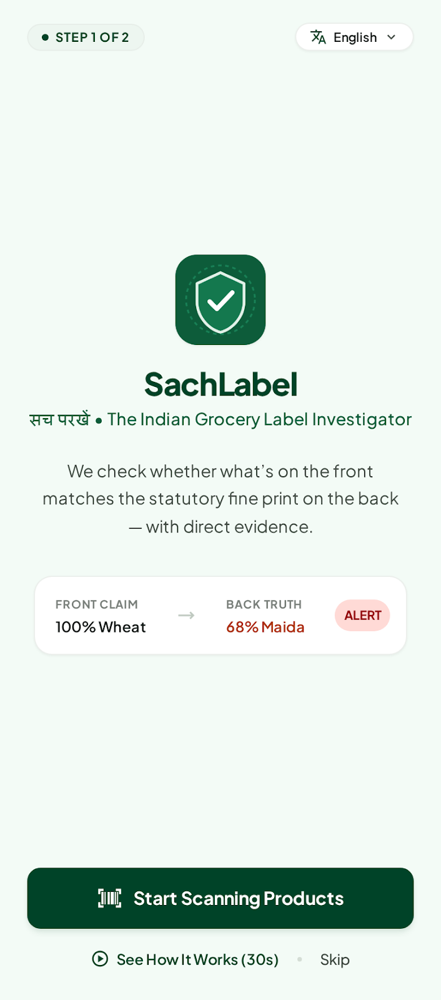
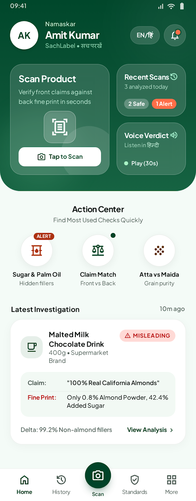
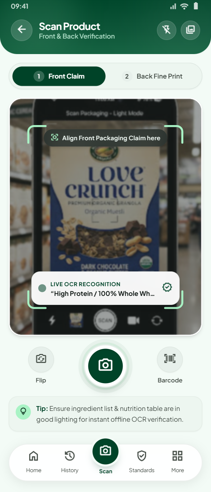
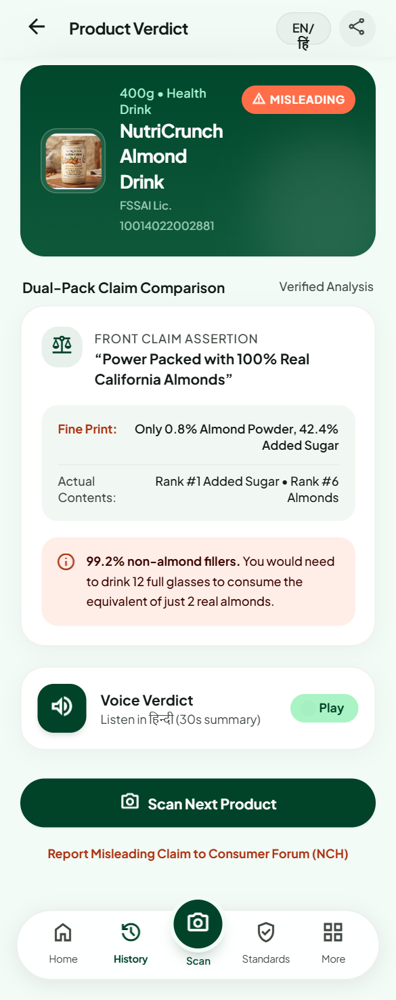
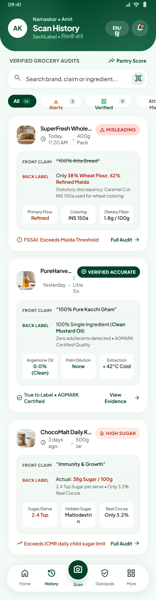
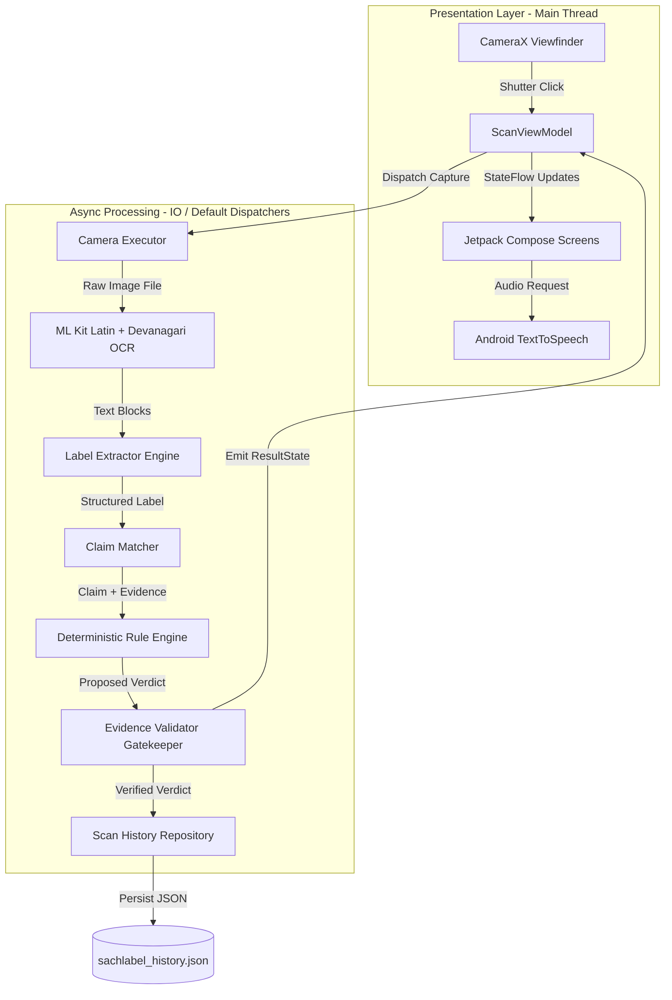

# SachLabel

> **AI that audits a product's own words against itself.**

SachLabel captures the front and back of a packaged food product, identifies a supported marketing claim, and audits that claim directly against the product's own mandatory ingredients list, nutritional declaration, and fine print. The app presents the factual verdict alongside exact verbatim package evidence in plain language, with regional-language spoken audio (Text-to-Speech) designed for in-aisle clarity.

SachLabel is **not** a general health-score app, a medical diagnostic tool, a government certification body, or a legal verification service. It is an independent, on-device evidence auditor that cross-references front-of-pack marketing assertions against statutory back-of-pack disclosures.

---

[](https://developer.android.com)
[](https://kotlinlang.org)
[](https://developer.android.com/jetpack/compose)
[](https://developer.android.com/training/camerax)
[](https://developers.google.com/ml-kit/vision/text-recognition/v2)
[]()
[]()
[](LICENSE)

---

## Visual Interface Overview

The interface follows a focused, evidence-first design language built with Jetpack Compose and Material 3, emphasizing high readability under supermarket aisle lighting:

| 1. Onboarding | 2. Home Dashboard | 3. Dual Camera Capture | 4. Evidence Verdict | 5. Past Audits History |
| :---: | :---: | :---: | :---: | :---: |
|  |  |  |  |  |
| *Clean welcome with mission & language selection* | *Curved header, smart scan trigger & recent audit stats* | *CameraX reticle, front/back step pill & live OCR* | *Verbatim dual evidence card & regional audio verdict* | *Verified past product audits with search & filter* |

---

## 1. What Problem Does It Solve?

In Indian grocery retail, packaged foods frequently feature prominent front-of-pack claims designed to capture purchasing decisions in seconds:

* *"100% Whole Wheat / Atta"*
* *"No Added Sugar"*
* *"Sugar-Free"*
* *"Zero Trans Fat"*
* *"No Artificial Preservatives"*
* *"Pure Butter / Desi Ghee"*

Under food labeling standards (such as FSSAI regulations), manufacturers are legally required to disclose the exact composition on the back of the pack — in the statutory ingredients list and nutritional information table. However, a significant gap exists between front-of-pack marketing and back-of-pack statutory reality:

1. **Information Asymmetry**: Fine print is deliberately small, printed on glossy or crinkled surfaces, and packed with complex chemical nomenclature (e.g., INS codes, maltodextrin, invert sugar, hydrogenated vegetable fat).
2. **Language & Literacy Barriers**: Packaged food claims and statutory disclosures in India are predominantly printed in English, while millions of primary grocery buyers read or communicate preferentially in Hindi, Tamil, Bengali, or other regional languages.
3. **In-Aisle Decision Pressure**: Consumers make buying choices in 3–5 seconds per item. Nobody has the time to manually cross-reference statutory percentages while standing in a store aisle.
4. **Misleading Nomenclature**: A biscuit labeled *"Wheat Rusk"* may legally contain 68% Refined Wheat Flour (Maida) and only 12% Whole Wheat (Atta), or a juice labeled *"No Added Sugar"* may be loaded with reconstituted fruit juice concentrates yielding over 14g of free sugar per 100ml.

SachLabel bridges this gap by mechanically reading both sides of the package and highlighting whether the brand's own mandatory disclosure corroborates or qualifies its promotional assertion.

---

## 2. How is SachLabel Different from Barcode-First Health Scanners?

Existing commercial food scanner applications typically follow a **barcode-to-database lookup** model. SachLabel takes a fundamentally different engineering and product approach:

| Dimension | Barcode-to-Database Scanners (e.g. Yuka) | SachLabel Dual-Pack Auditor |
| :--- | :--- | :--- |
| **Data Source** | Centralized product database indexed by EAN/UPC barcode. | The physical packaging in the user's hand, read via on-device computer vision. |
| **Catalog Lag & Coverage** | Fails on new products, regional Indian brands, unlisted stock, or recent formula updates. | 100% coverage on any package bearing English or Hindi text; zero catalog dependency. |
| **Assessment Methodology** | Arbitrary 0–100 algorithmic score based on generalized nutrition models. | **Deterministic evidence audit**: Evaluates whether the specific claim on the front is corroborated by the mandatory declaration on the back. |
| **Trust & Auditability** | Black-box algorithm; user must trust the app's scoring opinion. | **Zero synthetic evidence**: Cites the verbatim statutory line or flags absent disclosures directly from the package. |
| **Accessibility** | Dense English charts, graphs, and numeric metrics. | Plain-language spoken audio (Text-to-Speech) in **Hindi, Tamil, Bengali, and English**. |
| **Network & Privacy** | Requires cloud API calls; transmits user scanning habits. | **100% On-Device execution**: Photos never leave the phone; operational in offline store basements. |

---

## 3. System Design

SachLabel's system design is engineered around strict on-device predictability, immediate in-aisle latency, and zero cloud dependency.



### Core System Principles

1. **Two-Photo Decoupling**: Rather than attempting complex panoramic 3D mesh stitching across curved packaging in a single frame, the system explicitly captures two dedicated shots:
   - **Front Shot**: Maximizes optical resolution on bold promotional claims and brand badges.
   - **Back Shot**: Optimizes contrast and alignment on dense ingredient lists and tabular nutritional declarations.
2. **Deterministic Rules Over Generative Hallucination**: AI is employed strictly for sensory perception (OCR text block recognition and regex token extraction). The evaluation logic is 100% deterministic Kotlin code directly enforcing statutory FSSAI rules.
3. **Strict Concurrency & Threading Model**:
   - **Main Thread**: Renders 60 FPS declarative UI and drives Compose state transitions.
   - **Camera Executor**: Single-threaded dedicated pool managing CameraX buffer capture.
   - **Default Dispatcher (CPU-bound)**: Executes ML Kit recognition, string normalization, and regex rule matching.
   - **IO Dispatcher (Disk-bound)**: Persists audit records to `sachlabel_history.json` on app-internal storage.
4. **Zero-Cloud Privacy & Offline Execution**: Packaged food photos never leave the mobile device. No external analytics, tracking pixels, or LLM server endpoints are contacted.

---

## 4. End-to-End Processing Pipeline

The data transformation pipeline converts raw camera pixels into a legally defensible verdict in under 500 milliseconds:

```
[ FRONT PHOTO ] ──► [ ML Kit OCR ] ──► [ ClaimMatcher ] ────────┐
                                                                 ▼
                                                        [ RuleEngine ] ──► [ EvidenceValidator ] ──► [ UI & TTS ]
                                                                 ▲
[ BACK PHOTO ]  ──► [ ML Kit OCR ] ──► [ LabelExtractor ] ──────┘
                                        ├── ingredientsTokens
                                        └── nutritionRawLines
```

### Detailed Pipeline Stage Canvas

```
┌────────────────────────────────────────────────────────────────────────────────────────┐
│ STAGE 1: DUAL IMAGE CAPTURE (CameraX)                                                  │
│   • Step 1: Front frame capture -> cacheDir/sachlabel_front_TIMESTAMP.jpg              │
│   • Step 2: Back frame capture  -> cacheDir/sachlabel_back_TIMESTAMP.jpg               │
│   • Optical reticle guides alignment; flash toggle handles low-light supermarket aisles│
└──────────────────────────────────────────┬─────────────────────────────────────────────┘
                                           │
                                           ▼
┌────────────────────────────────────────────────────────────────────────────────────────┐
│ STAGE 2: OPTICAL CHARACTER RECOGNITION (Google ML Kit v2)                              │
│   • Dual Recognizer: TextRecognition.getClient(Latin + Devanagari)                     │
│   • Extracts text blocks with bounding-box coordinates for topological sort           │
│   • Preserves linebreaks and numeric indicators                                        │
└──────────────────────────────────────────┬─────────────────────────────────────────────┘
                                           │
                                           ▼
┌────────────────────────────────────────────────────────────────────────────────────────┐
│ STAGE 3: HEURISTIC LABEL SEGMENTATION & EXTRACTION                                     │
│   • Scans for statutory headers: "Ingredients:", "सामग्री:", "Nutritional Information"  │
│   • Tokenizes comma-separated ingredients in mandatory order of predominance          │
│   • Captures exact unparsed nutrition lines into nutritionRawLines                     │
└──────────────────────────────────────────┬─────────────────────────────────────────────┘
                                           │
                                           ▼
┌────────────────────────────────────────────────────────────────────────────────────────┐
│ STAGE 4: CLAIM DETECTION & TAXONOMY ROUTING                                            │
│   • Fuzzy regex matcher scans front text against 8 canonical categories                │
│   • Identifies target category: e.g. CanonicalClaimCategory.WHOLE_WHEAT_ATTA           │
│   • Rejects arbitrary claims outside canonical scope with NO_CLAIM_DETECTED            │
└──────────────────────────────────────────┬─────────────────────────────────────────────┘
                                           │
                                           ▼
┌────────────────────────────────────────────────────────────────────────────────────────┐
│ STAGE 5: DETERMINISTIC RULE EVALUATION                                                 │
│   • Invokes category-specific rule function in RuleEngine.kt                           │
│   • Compares claim against back reality:                                               │
│       - Checks first 3 ingredients for filler grains (Maida, Starch)                   │
│       - Checks nutrition table for sugar threshold (> 0.5g/100g)                       │
│       - Checks INS codes for Class II chemical preservatives                           │
│   • Emits: Verdict + Verbatim Evidence Quote + Matched Source                          │
└──────────────────────────────────────────┬─────────────────────────────────────────────┘
                                           │
                                           ▼
┌────────────────────────────────────────────────────────────────────────────────────────┐
│ STAGE 6: EVIDENCE GATEKEEPER & VALIDATION                                              │
│   • EvidenceValidator verifies that non-absent quotes exist verbatim in OCR raw text  │
│   • Rejects synthetic filler strings and hallucinated sentences                        │
│   • Flags absent statutory declarations explicitly via Evidence.absent(...)            │
└──────────────────────────────────────────┬─────────────────────────────────────────────┘
                                           │
                                           ▼
┌────────────────────────────────────────────────────────────────────────────────────────┐
│ STAGE 7: LOCALIZED PRESENTATION & AUDIO SYNTHESIS                                      │
│   • Renders DualEvidenceCard with side-by-side front claim vs back fine print          │
│   • Dynamically updates UI typography to selected locale (EN, HI, TA, BN)              │
│   • Android TextToSpeech synthesizes voice verdict for hands-free listening            │
└────────────────────────────────────────────────────────────────────────────────────────┘
```

---

## 5. Software Architecture & Clean MVVM Design

The codebase strictly adheres to Clean MVVM principles, separating presentation, business logic, and infrastructure:

```
app/src/main/java/com/sachlabel/app/
│
├── data/
│   ├── model/                  # Pure Kotlin Domain & Data Entities
│   │   ├── CanonicalClaimCategory.kt  # The 8 canonical FSSAI claim types
│   │   ├── Evidence.kt                # Verbatim quote carrier with absent flag
│   │   ├── ProductScan.kt             # Aggregated scan audit model
│   │   ├── StructuredLabel.kt         # Segmented ingredients & nutritionRawLines
│   │   ├── UserContext.kt             # Secondary dietary health presets
│   │   ├── UserLanguage.kt            # Supported locales (EN, HI, TA, BN)
│   │   └── Verdict.kt                 # MISLEADING, NEEDS_CONTEXT, CONSISTENT, etc.
│   │
│   └── repository/             # Offline Persistence
│       └── ScanHistoryRepository.kt   # JSON file-backed scan repository
│
├── health/                     # Secondary Dietary Relevance
│   └── HealthContextEngine.kt  # Informational allergen/diet matcher
│
├── ocr/                        # Vision & Text Parsing
│   ├── LabelExtractor.kt       # Statutory header segmentation & tokenizer
│   └── OcrRecognizer.kt        # ML Kit Latin + Devanagari wrapper
│
├── rules/                      # Core Deterministic Business Logic
│   ├── ClaimMatcher.kt         # Regex front-claim pattern detector
│   ├── ClaimRegistry.kt        # Multilingual claim pattern repository
│   ├── EvidenceValidator.kt    # Zero-synthetic-evidence enforcement gatekeeper
│   └── RuleEngine.kt           # 8 Canonical FSSAI verification rules
│
├── tts/                        # Audio Voice Synthesis
│   └── TtsManager.kt           # Native Android TextToSpeech engine
│
├── ui/                         # Presentation Layer (Jetpack Compose)
│   ├── components/             # Reusable Design System Widgets
│   │   ├── DualEvidenceCard.kt    # Side-by-side assertion vs reality card
│   │   ├── SachLabelBottomNav.kt  # Floating pill navigation dock
│   │   ├── SachLabelHeader.kt     # Signature curved gradient header
│   │   ├── VerdictBadge.kt        # High-contrast status badges
│   │   └── VoiceVerdictCard.kt    # Regional audio playback card
│   │
│   ├── navigation/             # App Navigation & Runtime Localization
│   │   └── SachLabelNavGraph.kt   # Navigation graph with dynamic LocalContext
│   │
│   ├── screens/                # The 10 Canonical Stitch Screens
│   │   ├── CaptureScreens.kt      # Screen 4 (Front) & Screen 5 (Back)
│   │   ├── HealthContextScreen.kt # Screen 8 (Secondary Dietary Relevance)
│   │   ├── HistoryScreen.kt       # Screen 9 (Past Audits & Search)
│   │   ├── HomeScreen.kt          # Screen 3 (Dashboard & Action Matrix)
│   │   ├── LanguageSelectScreen.kt# Screen 2 (Language Selection)
│   │   ├── MoreScreen.kt          # Screen 10 (Settings & Privacy)
│   │   ├── ProcessingScreen.kt    # Screen 6 (Staged Animated Checklist)
│   │   ├── ResultScreen.kt        # Screen 7 (Product Investigation Verdict)
│   │   ├── WelcomeScreen.kt       # Screen 1 (Onboarding & Mission)
│   │   └── WhatWeCheckScreen.kt   # Standards (The 8 Bounded Patterns)
│   │
│   └── theme/                  # Stitch Color Tokens & Typography
│       ├── Color.kt               # Mint canvas, forest green, crimson, amber
│       └── Theme.kt               # Material3 Theme configuration
│
└── viewmodel/                  # Application State Machine
    └── ScanViewModel.kt        # StateFlow driving UI state transitions
```

### UI State Machine Canvas

The user experience transitions through an explicit state machine managed by `ScanViewModel`:

```
┌─────────────────────────────────────────────────────────────────────────────┐
│                            UI STATE MACHINE                                 │
└─────────────────────────────────────────────────────────────────────────────┘

    [ IDLE ] 
       │
       ▼ (User taps "Start Scan")
    [ CAPTURING_FRONT ] ─────────► User confirms front photo
       │
       ▼ (Step 1 complete)
    [ CAPTURING_BACK ]  ─────────► User confirms back photo (or retakes front)
       │
       ▼ (Both photos acquired)
    [ PROCESSING ]
       ├── Step 1: Reading label… (ML Kit OCR)
       ├── Step 2: Finding claims… (ClaimMatcher)
       ├── Step 3: Checking evidence… (RuleEngine + EvidenceValidator)
       └── Step 4: Preparing explanation… (Verdict formulation)
       │
       ▼ (Verification complete)
    [ DISPLAYING_RESULT ]
       ├── Dual Evidence Card (Front quote vs Back statutory line)
       ├── Regional Audio Verdict (TTS playback in EN, HI, TA, BN)
       ├── Option: "What does this mean for me?" -> [ HEALTH_CONTEXT ]
       └── Option: "Scan Next Product" -> Reset to [ CAPTURING_FRONT ]
```

---

## 6. Canonical Claim Taxonomy (The Bounded 8 Rules)

To remain trustworthy, reproducible, and verifiable, SachLabel does not attempt open-ended AI interpretation. The v1 engine strictly enforces **8 canonical claim categories** derived from FSSAI labeling and display standards:

| # | Canonical Category | Front Packaging Claim | Verification Logic Against Back Label | Verdict Condition |
| :-: | :--- | :--- | :--- | :--- |
| **1** | `WHOLE_WHEAT_ATTA` | *"100% Whole Wheat"*, *"Atta"*, *"Gehu"* | Checks the first 3 statutory ingredients. Verifies whether Refined Wheat Flour (Maida) exceeds Whole Wheat (Atta) or appears as the primary ingredient. | **MISLEADING** if Maida > Atta or Maida is primary. |
| **2** | `NO_ADDED_SUGAR` | *"No Added Sugar"*, *"0% Added Sugar"* | Checks ingredients for alternate or hidden sugars: *maltodextrin, invert syrup, liquid glucose, high fructose corn syrup, honey, fruit juice concentrate*. | **NEEDS CONTEXT** if hidden sweeteners detected; **MISLEADING** if sucrose/sugar added. |
| **3** | `SUGAR_FREE` | *"Sugar Free"*, *"Zero Sugar"* | Checks the nutrition declaration for total sugars. Compares against the statutory threshold of **0.5g per 100g/100ml**. | **MISLEADING** if total sugars > 0.5g/100g. |
| **4** | `CHOLESTEROL_FREE`| *"Cholesterol Free"*, *"0mg Cholesterol"*| Validates cholesterol value (≤ 5mg/100g) and verifies saturated fat threshold (≤ 1.5g/100g). | **NEEDS CONTEXT** if saturated fat is high despite zero cholesterol. |
| **5** | `ZERO_TRANS_FAT` | *"Zero Trans Fat"*, *"0g Trans Fat"* | Checks nutrition table value (≤ 0.2g/100g) and inspects ingredients for *hydrogenated vegetable oil* or *partially hydrogenated fat*. | **NEEDS CONTEXT** if trans fat declared 0g but hydrogenated oil is listed. |
| **6** | `NO_ARTIFICIAL_PRESERVATIVES` | *"No Preservatives"*, *"Chemical Free"* | Scans ingredients for Class II chemical preservatives and INS codes (e.g., INS 211 Sodium Benzoate, INS 202 Potassium Sorbate, INS 220–228 Sulfites). | **MISLEADING** if synthetic preservatives are detected; cites absence if clean. |
| **7** | `FRUIT_CONTENT` | *"Made with Real Fruit"*, *"Real Fruit Juice"* | Inspects ingredient list for actual fruit pulp/juice percentage and flags water, sugar, or synthetic flavor as the primary ingredient. | **NEEDS CONTEXT** if fruit content is secondary (< 20%) to added water and sugar. |
| **8** | `PURE_GHEE_BUTTER` | *"Pure Desi Ghee"*, *"Made with Butter"* | Checks first 3 ingredients for blended vegetable oil, palm oil, interesterified fat, or vanaspati. | **MISLEADING** if vegetable fats or margarine substitute for dairy fat. |

---

## 7. What is Actually Implemented Today

The codebase contains a complete, functional Android implementation with zero mock stubs in the core verification pipeline:

* **Dual Camera Capture Pipeline**: Full CameraX integration capturing front promotional shots and back statutory shots with live OCR reticle assistance.
* **On-Device OCR**: ML Kit Text Recognition initialized with both Latin and Devanagari recognizers.
* **Deterministic Rule Engine**: Complete implementation of all 8 canonical FSSAI claim categories with 52/52 passing unit tests.
* **Zero Synthetic Evidence Validation**: Strict gatekeeping in `EvidenceValidator` ensuring every citation is verbatim package text.
* **Full 4-Language Localization**: Complete UI string parity across English, Hindi (`values-hi`), Tamil (`values-ta`), and Bengali (`values-bn`).
* **Runtime Language Switching**: Dynamic `LocalContext` configuration injection in Compose for instant language switching without restarting the app.
* **Regional Audio Feedback**: Native `TextToSpeech` manager delivering voice verdicts in all 4 supported languages.
* **Persistent Scan History**: Local JSON repository (`sachlabel_history.json`) storing past audits, supporting offline filtering by Alerts and Verified claims.
* **Secondary Health Context Screen**: Informational, non-diagnostic filter for user dietary concerns with mandatory statutory disclaimers.
* **5 Interactive Demo Scenarios**: Built-in test cases allowing immediate evaluation of all verdict states without physical packaging.

---

## 8. Technology Stack

| Layer | Library / Tool | Purpose |
| :--- | :--- | :--- |
| **Language** | Kotlin 1.9.23 | Modern, null-safe native Android development |
| **UI Framework** | Jetpack Compose (BOM 2024.04.01) | Declarative UI following the Stitch Design System |
| **Design System** | Material 3 + Custom Stitch Tokens | Premium, high-contrast, accessible visual language |
| **Architecture** | Single-Activity MVVM | Unidirectional data flow using Kotlin `StateFlow` and Coroutines |
| **Camera** | CameraX 1.3.3 | Stable camera lifecycle handling and frame capture |
| **OCR Engine** | Google ML Kit Text Recognition v2 | Fast, on-device OCR for Latin and Devanagari packaging |
| **Speech Engine** | `android.speech.tts.TextToSpeech` | Native multi-lingual voice synthesis |
| **Persistence** | File-backed JSON Storage | Lightweight, dependency-free local audit history |
| **Build System** | Gradle 8.2 (Kotlin DSL) | Modern Android build toolchain targeting Android 14 (API 34) |

---

## 9. The Evidence-First Safety & Trust Model

In domains touching consumer trust and brand claims, hallucination and unsubstantiated allegations carry serious risks. SachLabel enforces four non-negotiable safety principles:

### 1. The Zero Synthetic Evidence Guarantee
* The system **never** generates synthetic quotes, paraphrase summaries, or fabricated assertions.
* Nutritional values cited in verdicts must correspond to an actual raw line detected by the OCR engine in the nutrition declaration.
* When a claimed ingredient or preservative is not found on the label, the engine explicitly returns `Evidence.absent(...)` rather than quoting a manufactured sentence.
* `EvidenceValidator` runs as an automated gatekeeper before any verdict reaches the UI; if an evidence quote cannot be verified against the raw OCR stream, the verdict is blocked from rendering.

### 2. Hedged, Non-Defamatory Phrasing
Verdicts use restrained, legally defensible, and objective language:
* **Avoids**: *"This company is lying"*, *"This product is toxic"*, *"Fraudulent brand"*.
* **Employs**: *"Front claims 'No Added Sugar', but back packaging lists Liquid Glucose and 18g Total Sugars"*, *"Front claims 'Whole Wheat Rusk', but statutory ingredients list Refined Flour (Maida) as the primary ingredient (68%)"*.

### 3. Open Verification
Both sides of the package are displayed side-by-side on the `DualEvidenceCard`. Consumers can visually cross-check the highlighted citation against the physical box in their hand.

### 4. Non-Medical Secondary Health Context
The Health Context feature is strictly secondary, accessible only after the primary claim audit is presented. It explicitly includes a non-dismissible statutory disclaimer stating that the output represents informational ingredient matching, not medical advice or clinical diagnosis.

---

## 10. Building and Running the Project

### Prerequisites

* **Android Studio**: Android Studio Ladybug (2024.2+) or Koala.
* **JDK**: OpenJDK 17 or Microsoft OpenJDK 17.
* **Android SDK**: API 34 (Android 14) platform and build-tools installed.
* **Target Hardware**: Physical Android device running Android 8.0+ (API 26+) with camera support (or an Android Emulator with virtual camera enabled).

### Build Commands

1. **Clone the Repository**:
   ```bash
   git clone https://github.com/gintama1018/SachLabel.git
   cd SachLabel
   ```

2. **Set JDK Environment (Windows PowerShell)**:
   ```powershell
   $env:JAVA_HOME = "C:\Program Files\Microsoft\jdk-17.0.20.8-hotspot"
   ```

3. **Run the Automated Test Suite**:
   ```powershell
   .\gradlew.bat testDebugUnitTest
   ```
   *Executes all 52 deterministic rule engine, claim matcher, and evidence validator tests.*

4. **Assemble the Debug APK**:
   ```powershell
   .\gradlew.bat assembleDebug
   ```
   *Outputs the compiled APK to: `app/build/outputs/apk/debug/app-debug.apk`.*

5. **Install on Connected Device**:
   ```powershell
   .\gradlew.bat installDebug
   ```

---

## 11. Current Limitations

Honest engineering requires acknowledging real-world operational constraints:

* **Packaging Geometry & Reflection**: OCR accuracy degrades on shiny metallic pouches (foil chips bags), curved cylindrical bottles, or heavily crinkled packages. Clear, flat lighting produces the most reliable extraction.
* **Bounded Taxonomy**: The v1 rule engine checks only the **8 documented canonical categories**. Arbitrary or unsupported marketing phrases (e.g. *"Brain Booster"*, *"Authentic Royal Recipe"*) will correctly report `NO CLAIM DETECTED` rather than guessing.
* **Regional TTS Engine Availability**: Android's `TextToSpeech` engine relies on device-installed voice packs. While English and Hindi are standard on virtually all Indian Android builds, Tamil and Bengali voice synthesis depends on Google Speech Services being updated on the user's device.
* **Bilingual Mixed Packaging**: Packages where ingredients are split across multiple disconnected panels or wrapped around cylindrical seams require careful framing across the two capture shots.
* **Informational Scope**: SachLabel verifies packaging claim consistency against printed declarations. It does not perform laboratory chemical chromatography or verify whether a manufacturer secretly adulterated the product against its own printed ingredient declaration.

---

## 12. Roadmap

* [ ] **Multi-Frame Live Detection**: Real-time bounding-box guidance overlaying text directly on the camera preview before shutter release.
* [ ] **Cylindrical Pouch Stitching**: Multi-shot or sweep capture to assemble complete ingredient tables wrapped around round containers.
* [ ] **Expanded Canonical Rules**: Addition of FSSAI High-Fat-Sugar-Salt (HFSS) warning indicators, Sodium/Salt thresholds, and Palm Oil blending transparency.
* [ ] **Additional Regional Languages**: Extending full UI string localization and speech synthesis to Telugu, Marathi, Kannada, and Gujarati.
* [ ] **Local Small Language Model (SLM)**: Integration of a quantized on-device model (e.g., Gemma 2B via MediaPipe LLM Inference) strictly constrained to template-based conversational Q&A over the parsed label text.

---

## License

This project is licensed under the MIT License — see the [LICENSE](LICENSE) file for details.
